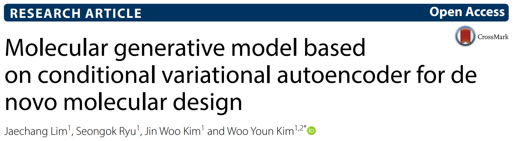

github for "Molecular generative model based on conditional variational autoencoder for de novo molecular design"

https://jcheminf.biomedcentral.com/articles/10.1186/s13321-018-0286-7

https://arxiv.org/abs/1806.05805

1. Fisrt, you need to prepare file containing smiles. each line of the file is smiles of a molecule (please see smiles.txt in this repo)
2. Calculate properties of molecules using following command
```
python cal_prop.py --input_filename=smiles.txt --output_filename=smiles_prop.txt
```
3. You can train a model using following command
```
python -u train.py --prop_file=smiles_prop.txt --save_dir=./save
```
4. After trining a model, you can generate molecules with desirable properties. Suppose you want to generate molecules whoe MW=300, LogP=4, and TPSA=100, then the command is following:
```
python sample.py --prop_file=smiles_prop.txt --save_file=save/model_3.ckpt-3 --target_prop='300 4 100' --result_filename=result.txt
```
The result will be written in result.txt
